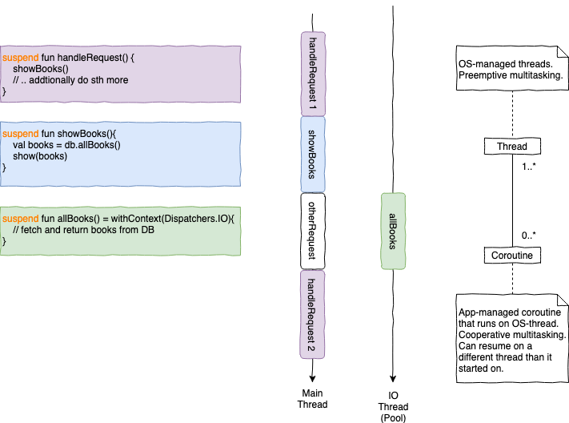

= Coroutines Sandbox with TornadoFx

*Features*

* Kotlin Coroutines
* TornadoFx (see link:https://github.com/edvin/tornadofx-guide[TornadoFx Guide])
* How coroutines can make your code non-blocking

== Usage

* Build `./gradlew build`

If you are on Java11 you need to add the link:https://github.com/edvin/tornadofx-guide/blob/master/part1/2.%20Setting%20Up.md[OpenJfx dependencies]
because JavaFx was removed from the JDK. The following additional gradle dependencies might do the trick:

`implementation("org.openjfx:javafx:11.0.2")`
`implementation("org.openjfx:javafx-base:11.0.2")`
`implementation("org.openjfx:javafx-controls:11.0.2")`

== More Examples

=== TornadoFx

* link:https://github.com/edvin/todomvc[TodoMvc] from which I took most view inspiration
* link:https://github.com/lunivore/hellbound[Hellbound: A Tetronimos desktop game] from which I took the event communication

=== Coroutines

* link:https://github.com/Richargh/concurrency-mvn-kt-sandbox[Concurrency Sandbox] especially contains many more examples, take a look at the tests if you want

== Coroutines

Threads are used for preemptive multitasking. After a fixed time the OS switches from one thread to the next.
Coroutines on the other hand are used for cooperative multitasking on the same thread.
The programmer has to write code that *yields* to another coroutine and does not block the thread forever.

Kotlin Coroutines are assigned to threads by a Dispatcher. That means a coroutine that yields might run on a different thread when being resumed.

Coroutines in general are becoming very popular because they allow very efficient use of the available resources.
NodeJs for example did only have a single thread for a long time and was still able to provide web server response times
that matched or exceeded one-thread-per-request web servers from other programming languages.

The reason for this is that for each request the web server does very little computing and mostly waits for other I/O-operations to terminate.
To fulfill the request `GET localhost:8080/books?named=Foo` the web server usually needs to access some kind of external database.
Many web servers block the thread until the database returns the list of books.

Node can use the event loop, process other web requests, and will be notified once the database operation completes.
A Coroutine-based server similarly can suspend the coroutine until the database operation completes.
Until the operation completes another coroutine can use the thread to answer another request.

=== Structured Concurrency

Kotlin Coroutines follow a principle the authors named "structured concurrency":
a coroutine scope only terminates when all it's children coroutine scopes have also terminated,
and all children inherit the context from it's parent.

That means we can write concurrent code that looks sequential and we can never forget to call `.await()` or similar operations.

== Coroutine Cheatsheet

This cheatsheet is inspired by the link:https://blog.kotlin-academy.com/kotlin-coroutines-cheat-sheet-8cf1e284dc35[one from Kotlin Academy].

=== Enter Coroutine Scope

To go from the blocking world into coroutine land we either:

* use `runBlocking { /* coroutine code here */}`
* delegating to a CoroutineScope `class Myclass(context: CoroutineContext): CoroutineScope by CoroutineScope(context)`

There are two more options which might fit your use case, they do have a major problem though. We can:

* implement `CoroutineScope` interface (which I use for CenterView)
* or use `GlobalScope.launch {}`

The major feature of Kotlin Coroutines is structured concurrency,
but the last two options *don't inherit the scope* from their parent. They do propagate their scope to their children though, so use them with caution.

=== Dispatcher

* Main dispatcher, usually single-thread, useful for UI operations: `Dispatcher.Main`
* Default dispatcher, threadcount usually equal to CPU-core count, useful for CPU-intensive computation: `Dispatcher.Default`
* IO dispatcher, threadcount usually 64, useful for operations that wait for IO to complete: `Dispatcher.IO`
* Single Thread context, always single-threaded, maybe useful for you: `newSingleThreadContext("name")`

=== Coroutine Builder

* Async op where you care for the result and await() completion: `async {}`
* Execute op in a new context and suspend until result: `withContext(Dispatcher.IO) {}`
* Fire and forget async op: `launch {}`
* Enter coroutine land and block thread until completion: `runBlocking {}`

